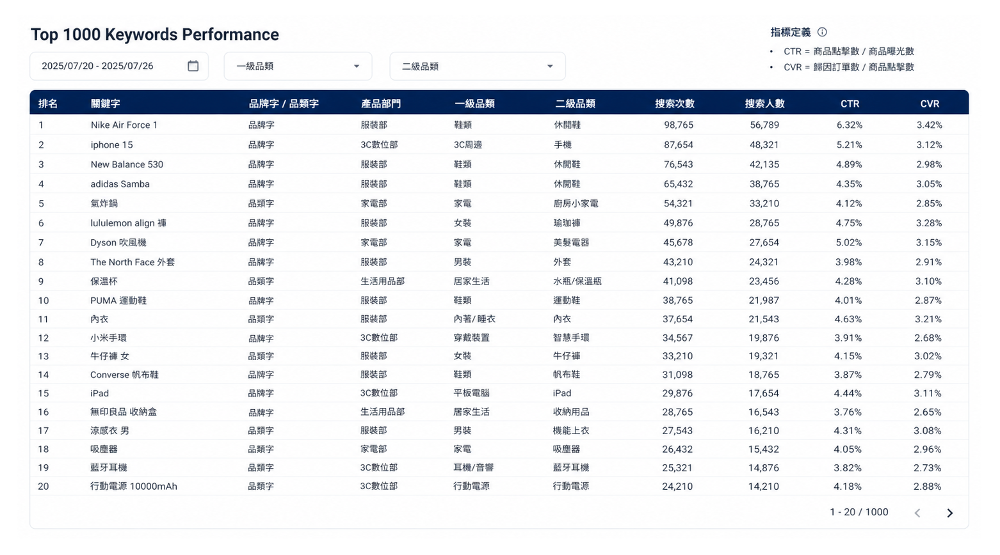

# Keyword Dashboard with BigQuery

## 📌 Problem
Keyword-level performance data lacked a unified analytical framework, making it difficult to connect search demand, product exposure, and downstream conversion outcomes (clicks, orders). As a result, teams were unable to effectively identify high-impact opportunities across categories and prioritize growth actions.

---

## 💡 Solution
Built a keyword analytics workflow where BigQuery served as the main data processing layer and Looker Studio was directly connected to the BigQuery output table for dashboard visualization.

Additional R scripts were used for offline validation, metric checking, and rule-based recommendation testing.

### BigQuery SQL — Main Dashboard Data Pipeline
- Parsed raw search event logs to extract keyword, product, impression, and click-level data  
- Constructed keyword × product × category datasets with 1P / 3P segmentation  
- Designed 24-hour last-click attribution logic linking search clicks to orders  
- Aggregated dashboard-ready metrics across keyword, category, supplier, and transaction dimensions  
- Produced the final BigQuery output table directly connected to Looker Studio  

### Looker Studio — Dashboard Visualization
- Connected directly to the final BigQuery output table  
- Visualized keyword search demand, product exposure, clicks, orders, and category-level opportunities  
- Supported recurring monitoring for internal and client-facing business discussions  

### R — Supplementary Analysis
- Used after the SQL pipeline for offline validation and metric checking  
- Tested CTR, CVR, product coverage, and supplier distribution calculations  
- Developed rule-based recommendation logic before dashboard implementation  
- Exported department-level Excel outputs for review  

---

## 🔍 Highlights
- Developed full funnel visibility from **search → exposure → click → conversion**  
- Integrated behavioral data with transaction data through attribution modeling  
- Built keyword-category prioritization logic based on supply-demand mismatch  
- Translated complex data into actionable, department-level recommendations  

---

## 📈 Impact
- Enabled end-to-end visibility across keyword performance and conversion funnel  
- Established a scalable BigQuery → Looker Studio pipeline for recurring dashboard monitoring  
- Reduced manual data processing by automating data transformation and validation workflows  
- Supported data-driven prioritization of product assortment and supplier strategy  

---

## 🛠 Tools
- BigQuery SQL (data extraction, transformation, attribution modeling)  
- Looker Studio (dashboard visualization)  
- R (supplementary analysis, validation, recommendation logic)  
- Excel (output & review)  
- Data Cleaning & Feature Engineering

---

## 🧠 Dashboard (Sample Visualization)

This dashboard mockup illustrates how keyword-level performance can be visualized in Looker Studio.

> *Note: This visualization is a mockup generated by AI for demonstration purposes only. It does not contain real business data.*
---

## ⚠️ Disclaimer
This repository uses sanitized descriptions and synthetic examples only.  
No proprietary data, client information, internal IDs, or confidential business logic are included.
